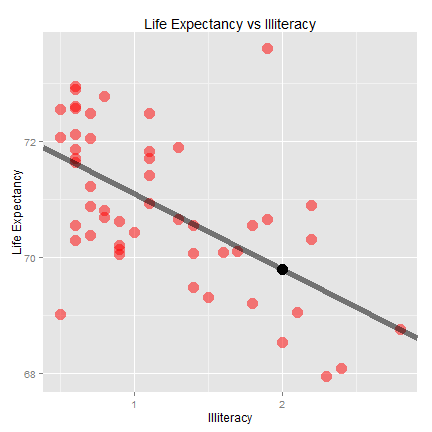

## Data Description

Data for this app comes from the state dataset in R. This dataset contains 50 rows
with statistics from each state, which were gathered in the 1970s. The 8 variables are:

* Population
* Income (per capita)
* Illiteracy (rate)
* Life.Exp (life expectancy)
* Murder (rate)
* HS.Grad (percentage of high school graduates)
* Frost (mean number of days below freezing in capital city)
* Area

---

## Relationships Between Variables

The pairs function provides a quick look at the relationships between the 8 variables.


--- &twocol

## App Description - Linear Regression

*** =fullwidth
This app allows a user to look more in depth at a particular pair of variables by plotting and summarizing the results of a linear regression.

*** =left
* Input variable: Illiteracy
* Output variable: Life Expectancy


```r
coef(mdl)
```

```
## (Intercept)  Illiteracy 
##   72.394947   -1.296023
```

```r
summary(mdl)$r.squared
```

```
## [1] 0.3463063
```

*** =right
 


--- &twocol

## App Description - Prediction

*** =fullwidth
The Shiny app also allows a user to input a value for the variable on the x-axis and predict the outcome for the variable on the y-axis using the linear model.

*** =left
### Input Value for Illiteracy

```
## [1] 2
```
### Predicted Value for Life Expectancy

```
##       1 
## 69.8029
```

*** =right
 
